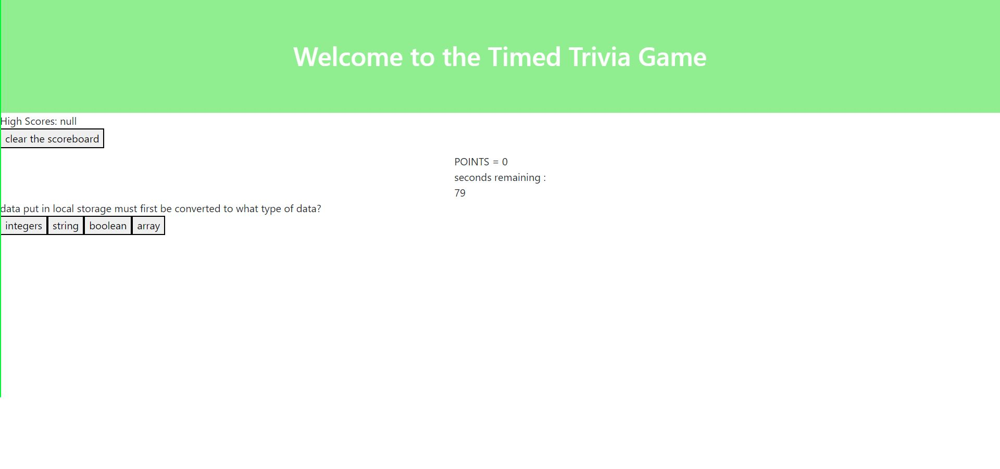

# timed-trivia

## features
- 7 javascript questions consisting of a true/false or multiple choice style
- functioning highscore board with clearing function
- responsive timer with penalty function for choosing the wrong answer

[trivia-site](https://samb56.github.io/timed-trivia/)

